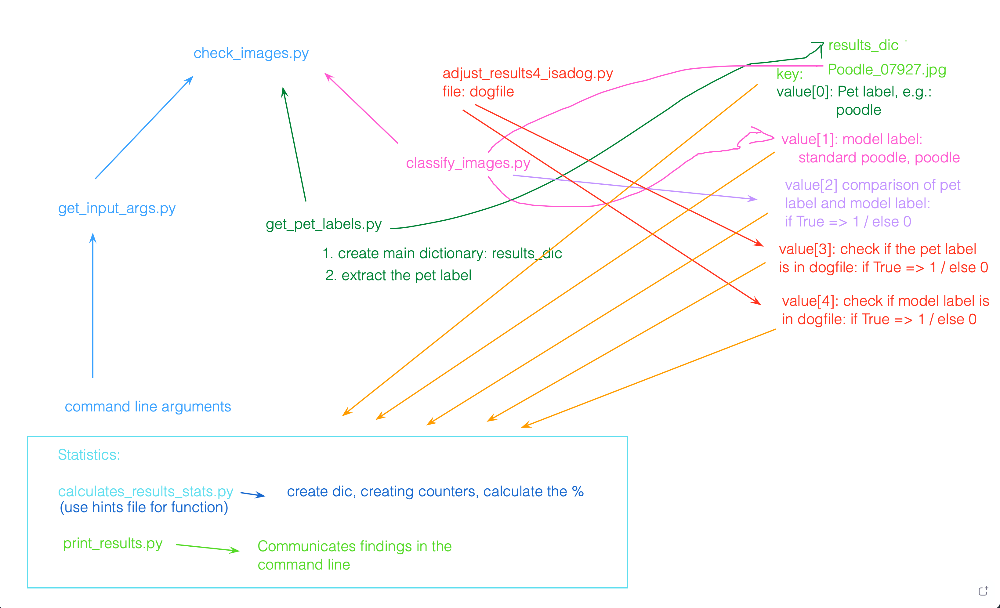

# Pretrained Image Classifier

This is the first project of the AI Programming with Python course, which aims to educate students in building programming architectures for AI models.

The Classifer was already trained on data and here we will built different functions, which will 1. predict our Images, and 2. Give statistics, about the dataset of Images, in terms of wheter Images actually are dogs, if so which dogbreed, and wether the classifier results correlate with the ground truth, which is the model-label of the image.

## Models
The programm is trained on 3 models, which are free to be chosen from with an optional argument in the command line:
- vgg
- resnet
- alexnet
## Files

- **check_images.py** _(Main function)_
- get_pet_labels.py
- adjust_results4_isadog.py
- print_functions_for_lab_checks.py
- print_results.py
- calculates_results_stats.py
- classifier.py
- run_models_batch.sh
- classify_images.py
- run_models_batch_uploaded.sh
- classify_images_hints.py
- test_classifier.py
- dognames.txt
- uploaded_images
- get_input_args.py
- vgg_pet-images.txt
- get_input_args_hints.py
- vgg_uploaded-images.txt

## Diagram OF Functions

### Terminal command
The programm can be run the following way from the terminal:

`python check_images.py --arch resnet`

This will run the default **dataset** and default **dogfile**, please see Diagram above.

